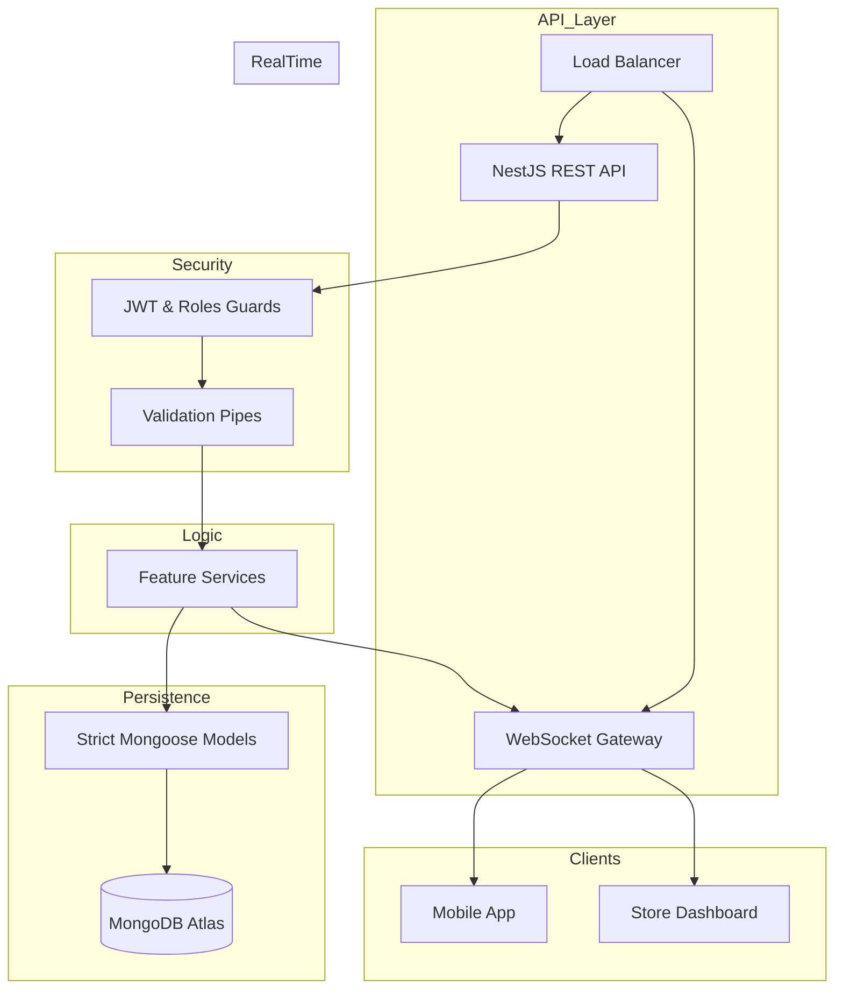

# 🍽️ TabletTap AI: Progressive Dining Backend
> **Enterprise-Grade Restaurant Order Management System**

<div align="center">
  
  
  
  
  
  <br />
  [](https://github.com/ismoiljon1101/tabletap-be)
  [](https://www.typescriptlang.org/)
  [](#-license)
</div>

---

## 🛡️ Hardened Core Architecture

The TabletTap AI backend has undergone a **Phase 1 Hardening Sprint**, reaching a "Zero-Any, Zero-Crash" production state.

### Engineering Standards
- **Exhaustive Type Safety**: `strict: true` compliance across the entire workspace. Generic `any` types have been abolished in favor of explicit interfaces and DTOS.
- **Graceful Error Handling**: Every controller method is audited and wrapped in `try-catch` blocks, ensuring runtime stability and detailed server-side logging.
- **Context Isolation**: A specialized `AuthenticatedRequest` layer provides type-safe, restaurant-isolated execution context for every request.
- **Atomic DTO Validation**: Unified input validation via `class-validator` ensures data integrity before it reaches the business logic.
- **Schema Synchronization**: Mongoose models are meticulously mapped to TypeScript types using definite assignment assertions for 100% compile-time safety.

---

## 🏗️ System Architecture



---

## 📋 Module Overview

| Module | Purpose | Access Control |
| :--- | :--- | :--- |
| **Auth** | Multi-role Identity Management (JWT/Google) | Public / User |
| **Users** | Profile management & Account lifecycle | Authenticated |
| **Restaurants** | Core entity configuration & Analytics | Owner / Admin |
| **Tables** | Layout management & Real-time occupancy | Waiter / Owner |
| **Menu** | Product catalog, Modifiers & Availability | Waiter / Owner |
| **Categories** | Hierarchical menu organization | Owner |
| **Sections** | Restaraunt area organization (e.g., Terrace) | Owner |
| **Orders** | Kitchen flow, Payment & Live updates | Waiter / Owner |

---

## 🛠️ Prerequisites & Setup

### Requirements
- **Node.js**: `v18.0.0+`
- **Database**: `MongoDB 6.0+`
- **Package Manager**: `pnpm` (Mandatory for dependency resolution)

### Installation

```bash
# Clone the repository
git clone https://github.com/ismoiljon1101/tabletap-be.git
cd tabletap-be

# Install dependencies with pnpm
pnpm install
```

### Environment Configuration

Copy `.env.example` to `.env` and configure:

| Variable | Description | Example |
| :--- | :--- | :--- |
| `MONGODB_URI` | Connection string for MongoDB | `mongodb+srv://...` |
| `JWT_SECRET` | Secret key for token signing | `very_secret_key` |
| `PORT` | Application port | `3000` |
| `GOOGLE_CLIENT_ID` | OAuth Client ID | `client-id.apps.googleusercontent.com` |

---

## 📡 Exhaustive API Documentation (v1)

### 🔐 Authentication (`/auth`)
| Method | Path | Description | Access |
| :--- | :--- | :--- | :--- |
| `POST` | `/register` | Register User + Restaurant | Public |
| `POST` | `/login` | Standard Email Login | Public |
| `POST` | `/google` | Google OAuth 2.0 Auth | Public |
| `POST` | `/refresh` | Refresh Access Token | Authenticated |
| `POST` | `/logout` | Invalidate Session | Authenticated |
| `GET` | `/me` | Get Current User Context | Authenticated |

### 👤 User Management (`/users`)
| Method | Path | Description | Access |
| :--- | :--- | :--- | :--- |
| `GET` | `/debug` | Developer User Diagnostics | Authenticated |
| `PATCH` | `/:id` | Update Profile Details | Owner Only |
| `DELETE` | `/:id` | Permanent Account Deletion | Owner Only |

### 🏠 Restaurant Management (`/restaurants`)
| Method | Path | Description | Access |
| :--- | :--- | :--- | :--- |
| `GET` | `/:id` | Get Restaurant Details | Context-Bound |
| `PUT` | `/:id` | Update Identity/Settings | Owner/Admin |
| `GET` | `/:id/analytics` | Fetch Sales & Order Metrics | Owner/Admin |
| `DELETE` | `/:id` | Terminate Restaurant Entity | Admin Only |

### 🪑 Table Management (`/tables`)
| Method | Path | Description | Access |
| :--- | :--- | :--- | :--- |
| `POST` | `/batch` | Rapid Table Generation | Owner/Admin |
| `POST` | `/` | Single Table Creation | Owner/Admin |
| `GET` | `/` | List Resident Tables | Authenticated |
| `GET` | `/:id` | View Individual Table | Authenticated |
| `PUT` | `/:id` | Update Table Metadata | Owner/Admin |
| `DELETE` | `/:id` | Remove Table | Owner/Admin |

### 🍕 Menu System (`/menu`)
| Method | Path | Description | Access |
| :--- | :--- | :--- | :--- |
| `POST` | `/` | Create Menu Item | Owner/Admin |
| `GET` | `/` | Catalog Retrieval (Filtered) | Authenticated |
| `GET` | `/:id` | View Menu Item Details | Authenticated |
| `PUT` | `/:id` | Edit Item & Modifiers | Owner/Admin |
| `PATCH` | `/:id/toggle` | Quick Availability Toggle | Owner/Admin |
| `DELETE` | `/:id` | Remove from Catalog | Owner/Admin |

---

## 📡 WebSocket Real-Time Gateway

TabletTap uses **Socket.io** for millisecond-latency communication between the floor and the kitchen.

### Subscribe Events
- `joinRestaurant`: Binds the socket to a specific restaurant room.

### Published Events
- `order-created`: Broadcasts a full order payload when a new ticket is submitted.
- `order-updated`: Syncs status changes (e.g., `PENDING` -> `PREPARING`).
- `table-status-changed`: Updates the floor map when a table becomes occupied or free.
- `kitchen-alert`: High-priority event containing `{ orderId, orderNumber, tableId }`.

---

## 📁 System Blueprint

```text
src/
├── auth/            # Identity, JWT Strategies & Protection
├── common/          # Universal Enums, DTOs & Constants
├── modules/         # Business Verticals
│   ├── restaurants/ # Establishment configs
│   ├── tables/      # Floor map management
│   ├── menu/        # Catalog management
│   ├── orders/      # Core logic & WebSocket gateways
│   ├── sections/    # Physical area organization
│   └── categories/  # Hierarchical grouping
├── main.ts          # Global Middlewares (Helmet, CORS, Validation)
└── app.module.ts    # Main Dependency Injection Root
```

---

## 📝 Engineering Standards

1. **Commit Convention**: All commits must follow the [Conventional Commits](https://www.conventionalcommits.org/) spec.
2. **Strict Typing**: Usage of `any` is a blocking lint error. All requests must extend `AuthenticatedRequest`.
3. **Atomic Operations**: Service methods use Mongoose transactions where data consistency is critical.
4. **Documentation**: Every new feature must be accompanied by updated README and OpenAPI (Swagger) annotations.

---

## 👥 Support & License

**Copyright © 2025 Ismoiljon Masharipov.**
*Proprietary and Confidential.*

For enterprise support or integration queries, please reach out to the core development team.

---
<div align="center">
  Built with ❤️ for the future of hospitality.
</div>
